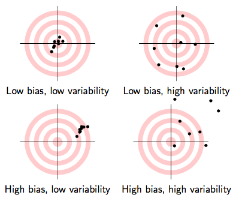

```{r setup, include=FALSE}
options(htmltools.dir.version = FALSE)
knitr::opts_chunk$set(echo=F,
                      message=F,
                      warning=F)
library(tidyverse)
set.seed(256)
update_geom_defaults("label", list(family = "Fira Sans Condensed"))
```

```{r regression-setup, echo=F, results="hide"}

library(haven)
CASchool<-read_dta("../data/caschool.dta")

# run regression of testscr on str
school_reg <- lm(testscr ~ str, 
                 data = CASchool)

library(broom)
school_reg_tidy <- tidy(school_reg,
     conf.int = TRUE) # add confidence intervals
CASchool_aug <- augment(school_reg)

library(equatiomatic)
extract_eq(school_reg, use_coefs = TRUE,coef_digits = 2,fix_signs = TRUE)

```

class: inverse

# Outline

### [Goodness of Fit](#3)

### [Bias: The Sampling Distributions of the OLS Estimators](#29)

### [Bias and Exogeneity](#45)

---

class: inverse, center, middle
# Goodness of Fit

---

# Models

.pull-left[

> "All models are wrong. But some are useful." - George Box

]

.pull-right[
.center[

]
]

---

# Models

.pull-left[

> "All models are wrong. But some are useful." - George Box

### All of Statistics: 

$$Observed_i = \widehat{Model}_i + Error_i$$

]

.pull-right[
.center[

]
]

---

# Goodness of Fit

- How well does a line fit data? How tightly clustered around the line are the data points?

- Quantify .hi-purple[how much variation in `\\(Y_i\\)` is "explained" by the model]

--

$$\underbrace{Y_i}_{Observed}=\underbrace{\widehat{Y_i}}_{Model}+\underbrace{\hat{u}}_{Error}$$


- Recall OLS estimators chosen to minimize .hi[Sum of Squared Errors (SSE)]: $\left(\displaystyle \sum^n_{i=1}\hat{u_i}^2\right)$

---

# Goodness of Fit: $R^2$

- Primary measure<sup>.magenta[†]</sup> is .hi[regression R-squared], the fraction of variation in $Y$ explained by variation in predicted values $(\hat{Y})$

$$R^2 = \frac{var(\widehat{Y_i})}{var(Y_i)}$$

.footnote[<sup>.magenta[†]</sup> Sometimes called the .hi["coefficient of determination"]]

---

# Goodness of Fit: $R^2$ Formula

.smaller[
$$R^2 =\frac{ESS}{TSS}$$ 
]

--

.smallest[
- .hi-purple[Explained Sum of Squares (ESS)]:<sup>.magenta[†]</sup> sum of squared deviations of *predicted* values from their mean<sup>.magenta[‡]</sup>
]

--

.smallest[
$$ESS= \sum^n_{i=1}(\hat{Y_i}-\bar{Y})^2$$
]

--

.smallest[
- .hi-purple[Total Sum of Squares (TSS)]: sum of squared deviations of *observed* values from their mean
]

--

.smallest[
$$TSS= \sum^n_{i=1}(Y_i-\bar{Y})^2$$
]

.footnote[
.quitesmall[
<sup>.magenta[1]</sup> Sometimes called Model Sum of Squares (MSS) or Regression Sum of Squares (RSS) in other textbooks

<sup>.magenta[2]</sup> It can be shown that $\bar{\hat{Y_i}}=\bar{Y}$
]
]

---

# Goodness of Fit: $R^2$ Formula II

- Equivalently, the complement of the fraction of *unexplained* variation in $Y_i$ 

$$R^2=1-\frac{SSE}{TSS}$$

- Equivalently, the square of the correlation coefficient between $X$ and $Y$: 

--

$$R^2=(r_{X,Y})^2$$

---

# Visualizing $R^2$

.pull-left[
.smallest[
- **Total Variation in Y**: Areas .hi-red[A] + .hi-purple[C]

$$TSS = \sum^n_{i=1}(Y_i-\bar{Y})^2$$

- .hi-purple[Variation in Y explained by X]: .hi-purple[Area C]

$$ESS = \sum^n_{i=1}(\hat{Y_i}-\bar{Y})^2$$

- .hi-red[Unexplained variation in Y]: .hi-red[Area A]
$$SSE = \sum^n_{i=1}(\hat{u_i})^2$$
]
]

.pull-right[
$$R^2 = \frac{ESS}{TSS} = \frac{\color{purple}{C}}{\color{red}{A}+\color{purple}{C}}$$

```{r}
library(ggforce)
venn_gen_colors <-c("blue", "red")
venn_gen_df <-tibble(
  x = c(0, 1.5),
  y = c(0, 0),
  r = c(1,1),
  l = c("Y", "X"),
  xl = c(0, 1.5),
  yl = c(0, 0),
)

ggplot(data = venn_gen_df)+
  aes(x0 = x,
      y0 = y,
      r = r,
      fill = l,
      color = l)+
  geom_circle(alpha = 0.3, size = 0.75)+
  geom_text(aes(x = xl, y = yl, label = l), size = 9, family = "Fira Sans Book", parse = F)+
  theme_void()+
  theme(legend.position = "none")+
  scale_fill_manual(values = venn_gen_colors)+
  scale_color_manual(values = venn_gen_colors)+
  annotate(x = 0, y = 0.2, label = "A", geom = "text", size = 7, family = "Fira Sans Book")+
  annotate(x = 1.5, y = 0.2, label = "B", geom = "text", size = 7, family = "Fira Sans Book")+
  annotate(x = 0.75, y = 0.2, label = "C", geom = "text", size = 7, family = "Fira Sans Book")+
  coord_equal()
```
]

---

# Visualizing $R^2$

.pull-left[

.smallest[
.code60[
```{r, echo = T}
# make a function to calc. sum of sq. devs
sum_sq <- function(x){sum((x - mean(x))^2)}

# find total sum of squares
TSS <- school_reg %>%
  augment() %>%
  summarize(TSS = sum_sq(testscr))

# find explained sum of squares
ESS <- school_reg %>%
  augment() %>%
  summarize(TSS = sum_sq(.fitted))

# look at them and divide to get R^2
tribble(
  ~ESS, ~TSS, ~R_sq,
  ESS, TSS, ESS/TSS
  ) %>%
  knitr::kable()
```
]
]
]

.pull-right[
$$R^2 = \frac{ESS}{TSS} = \frac{\color{purple}{C}}{\color{red}{A}+\color{purple}{C}}=0.05$$

```{r}
library(ggforce)
venn_colors <-c("blue", "red")
venn_df <-tibble(
  x = c(0, 1.2),
  y = c(0, 0),
  r = c(1,0.3),
  l = c("Test Score", "STR"),
  xl = c(0, 1.2),
  yl = c(0, 0),
)

areas <- tribble(
  ~x, ~y, ~ll,
  0, 1, "A",
  1.15, 0.2, "C",
  1.2, 0.2, "B"
)

ggplot(data = venn_df)+
  aes(x0 = x,
      y0 = y,
      r = r,
      fill = l,
      color = l)+
  geom_circle(alpha = 0.3, size = 0.75)+
  geom_text(aes(x = xl, y = yl, label = l), size = 9, family = "Fira Sans Book", parse = F)+
  theme_void()+
  theme(legend.position = "none")+
  scale_fill_manual(values = venn_colors)+
  scale_color_manual(values = venn_colors)+
  annotate(x = 0, y = 0.2, label = "A", geom = "text", size = 7, family = "Fira Sans Book")+
  annotate(x = 1.2, y = 0.2, label = "B", geom = "text", size = 7, family = "Fira Sans Book")+
  annotate(x = 0.95, y = 0.0, label = "C", geom = "text", size = 7, family = "Fira Sans Book")+
 # geom_label(data = areas,
  #          aes(x = x,
   #             y = y,
   #             label = ll)
 #           )+
 # annotate(
  #  x = -5.5, y = 3.3,
  #  geom = "text", label = "Multiple regression", size = 9, family = "Fira Sans Book",
  #  hjust = 0) +
  #xlim(-5.5, 4.5) +
  #ylim(-4.2, 3.4) +
  
  coord_equal()
```

]

---

# Calculating $R^2$ in R I

- Recall `broom`'s `augment()` command makes a lot of new regression-based values like:
    - `.fitted`: predicted values $(\hat{Y_i})$
    - `.resid`: residuals $(\hat{u_i})$
    
```{r, echo=T}
library(broom)
school_reg %>%
  augment() %>%
  head(., n=5) # show first 5 values
```

---

# Calculating $R^2$ in R II

- Or, simpler, can calculate $R^2$ in `R` as the ratio of variances in model vs. actual 

.code60[
```{r, echo = T}
# as ratio of variances
school_reg %>%
  augment() %>%
  summarize(r_sq = var(.fitted)/var(testscr)) # var. of *predicted* testscr over var. of *actual* testscr
```
]

$$R^2 = \frac{var(\hat{Y})}{var(Y)} = \frac{\color{red}{\frac{1}{n-1}}\sum^n_{i=1}(\hat{Y_i}-\bar{Y})^2}{\color{red}{\frac{1}{n-1}}\sum^n_{i=1}(Y_i-\bar{Y})^2} \rightarrow \frac{ESS}{TSS}$$

- ESS and TSS are simply the numerators of the variance of $\hat{Y}$ and $Y$, respectively (i.e. before dividing by $n-1$, which will cancel out).

---

# Goodness of Fit: Standard Error of the Regression

- .hi[Standard Error of the Regression], $\hat{\sigma}$ or $\hat{\sigma}_{u}$ is an estimator of the standard deviation of $u_i$

--

$$\hat{\sigma_u}=\sqrt{\frac{SSE}{n-2}}$$

--

- Measures the .hi-purple[average size of the residuals] (distances between data points and the regression line)
  - An average prediction error of the line
  - .hi-turquoise[Degrees of Freedom correction] of $n-2$: we use up 2 df to first calculate $\hat{\beta_0}$ and $\hat{\beta_1}$!

---

# Calculating SER in R

.pull-left[

```{r, echo=T, eval=F}
school_reg %>%
  augment() %>%
  summarize(SSE = sum(.resid^2),
            df = n()-2,
            SER = sqrt(SSE/df))
```
]

.pull-right[

```{r, echo=F}
school_reg %>%
  augment() %>%
  summarize(SSE = sum(.resid^2),
            df = n()-2,
            SER = sqrt(SSE/df))
```
]

--

.smallest[
In large samples (where $n-2 \approx n)$, SER $\rightarrow$ standard deviation of the residuals
]

.pull-left[

```{r, echo=T, eval=F}
school_reg %>%
  augment() %>%
  summarize(sd_resid = sd(.resid))
```
]

.pull-right[
```{r, echo=F}
school_reg %>%
  augment() %>%
  summarize(sd_resid = sd(.resid))
```

]

---

# Goodness of Fit: Looking at R I

.pull-left[
.smaller[
- `summary()` command in `Base R` gives:
  - `Multiple R-squared`
  - `Residual standard error` (SER)
    - Calculated with a df of $n-2$
]

```{r, echo=T, eval=F}
# Base R
summary(school_reg)
```
]

.pull-right[
.code50[
```{r}
summary(school_reg)
```
]
]

---

# Goodness of Fit: Looking at R II

.code60[
```{r, echo=T}
# using broom
library(broom)
glance(school_reg)
```

]

--

.smallest[
- `r.squared` is `0.05` $\implies$ about 5% of variation in `testscr` is explained by our model
- `sigma` (SER) is `18.6` $\implies$ average test score is about 18.6 points above/below our model's prediction
]

--

.code50[
```{r, echo=T}
# extract it if you want with pull
school_r_sq <- glance(school_reg) %>% pull(r.squared)
school_r_sq
```
]

---

class: inverse, center, middle

# Bias: The Sampling Distributions of the OLS Estimators

---

# Recall: The Two Big Problems with Data

.pull-left[
.smallest[
- We use econometrics to .hi-purple[identify] causal relationships and make .hi-purple[inferences] about them

1. Problem for .hi-purple[identification]: .hi[endogeneity]
    - $X$ is **exogenous** if its variation is *unrelated* to other factors $(u)$ that affect $Y$
    - $X$ is **endogenous** if its variation is *related* to other factors $(u)$ that affect $Y$

2. Problem for .hi-purple[inference]: .hi[randomness]
    - Data is random due to **natural sampling variation**
    - Taking one sample of a population will yield slightly different information than another sample of the same population
]

]

.pull-right[
.center[


]
]

---

# Distributions of the OLS Estimators

- OLS estimators $(\hat{\beta_0}$ and $\hat{\beta_1})$ are computed from a finite (specific) sample of data

- Our OLS model contains **2 sources of randomness**:

--

- .hi-purple[*Modeled* randomness]: $u$ includes all factors affecting $Y$ *other* than $X$
    - different samples will have different values of those other factors $(u_i)$

--

- .hi-purple[*Sampling* randomness]: different samples will generate different OLS estimators
    - Thus, $\hat{\beta_0}, \hat{\beta_1}$ are *also* **random variables**, with their own <span class=hi>sampling distribution</span>

---

# Inferential Statistics and Sampling Distributions

.pull-left[
.smallest[
- .hi[Inferential statistics] analyzes a **sample** to make inferences about a much larger (unobservable) **population**

- .hi-purple[Population]: all possible individuals that match some well-defined criterion of interest
  - Characteristics about (relationships between variables describing) populations are called .hi-turquoise[“parameters”] 

- .hi-purple[Sample]: some portion of the population of interest to *represent the whole*
  - Samples examine part of a population to generate .hi-turquoise[statistics] used to .hi[estimate] population .hi-turquoise[parameters]
  
]
]

.pull-right[
.center[

]
]

---

# Sampling Basics

.smaller[
.bg-washed-green.b--dark-green.ba.bw2.br3.shadow-5.ph4.mt5[
.green[**Example**]: Suppose you randomly select 100 people and ask how many hours they spend on the internet each day. You take the mean of your sample, and it comes out to 5.4 hours. 
]
]

--
.smaller[
- 5.4 hours is a .hi-purple[sample statistic] describing the sample; we are more interested in the corresponding .hi-turquoise[parameter] of the relevant population (e.g. all Americans)
]

--

.smaller[
- If we take another sample of 100 people, would we get the same number?
]
--

.smaller[
- Roughly, but probably not exactly

- .hi[Sampling variability] describes the effect of a statistic varying somewhat from sample to sample
  - This is *normal*, not the result of any error or bias!
]
---

# I.I.D. Samples

.pull-left[

- If we collect many samples, and each sample is randomly drawn from the population (and then replaced), then the distribution of samples is said to be .hi-purple[independently and identically distributed (i.i.d.)]

- Each sample is **independent** of each other sample (due to replacement)

- Each sample comes from the **identical** underlying population distribution

]

.pull-right[
.center[

]
]

---

# The Sampling Distribution of OLS Estimators

.pull-left[
- Calculating OLS estimators for a sample makes the OLS estimators *themselves* random variables:

- Draw of $i$ is random $\implies$ value of each $(X_i,Y_i)$ is random $\implies$ $\hat{\beta_0},\hat{\beta_1}$ are random

- Taking different samples will create different values of $\hat{\beta_0},\hat{\beta_1}$

- Therefore, $\hat{\beta_0},\hat{\beta_1}$ each have a .hi[sampling distribution] across different samples 

]

.pull-right[

.center[

]

]

---

# The Central Limit Theorem

- .hi[Central Limit Theorem (CLT)]: if we collect samples of size $n$ from the same population and generate a sample statistic (e.g. OLS estimator), then with large enough $n$, the distribution of the sample statistic is approximately normal IF 
    1. $n \geq 30$
    2. Samples come from a *known* normal distribution $\sim N(\mu,\sigma)$

--

- If neither of these are true, we have other methods (coming shortly!) 

- One of the most fundamental principles in all of statistics

- Allows for virtually all testing of statistical hypotheses $\rightarrow$ estimating probabilities of values on a normal distribution

---

# The Sampling Distribution of $\hat{\beta_1}$ I

.pull-left[

- The CLT allows us to approximate the sampling distributions of $\hat{\beta_0}$ and $\hat{\beta_1}$ as normal

- We care about $\hat{\beta_1}$ (slope) since it has economic meaning, rarely about $\hat{\beta_0}$ (intercept)

$$\hat{\beta_1} \sim N(E[\hat{\beta_1}], \sigma_{\hat{\beta_1}})$$


]

.pull-right[

```{r, fig.retina=3}
beta_dist<-ggplot(data = tibble(x=-4:4))+
  aes(x = x)+
  stat_function(fun = dnorm, size=2, color="blue")+
  geom_segment(aes(x=0,xend=0, y=0, yend=0.4), linetype="dashed")+
  scale_x_continuous(breaks = 0,
                     labels = expression(E(hat(beta[1]))))+
  labs(x = expression(hat(beta[1])),
       y = "Probability")+
  theme_classic(base_family = "Fira Sans Condensed",
           base_size=20)
beta_dist
```

]
---

# The Sampling Distribution of $\hat{\beta_1}$ II

.pull-left[

$$\hat{\beta_1} \sim N(E[\hat{\beta_1}], \sigma_{\hat{\beta_1}})$$

- We want to know: 

1. $E[\hat{\beta_1}]$; what is the .hi-purple[center] of the distribution? (today)

2. $\sigma_{\hat{\beta_1}}$; how .hi-purple[precise] is our estimate? (next class)


]

.pull-right[

```{r, fig.retina=3}
beta_dist
```

]

---

class: inverse, center, middle
# Bias and Exogeneity

---

# Assumptions about Errors I

.pull-left[

- In order to talk about $E[\hat{\beta_1}]$, we need to talk about $u$

- Recall: $u$ is a random variable, and we can never measure the error term

]

.pull-right[

.center[

]
]

---

# Assumptions about Errors II

.pull-left[
.smallest[
- We make .hi[4 critical **assumptions** about `\\(u\\)`]:

]
]

.pull-right[

.center[

]
]

---

# Assumptions about Errors II

.pull-left[
.smallest[
- We make .hi[4 critical **assumptions** about `\\(u\\)`]:

1. The expected value of the residuals is 0
$$E[u]=0$$

]
]

.pull-right[

.center[

]
]

---

# Assumptions about Errors II

.pull-left[
.smallest[
- We make .hi[4 critical **assumptions** about `\\(u\\)`]:

1. The expected value of the residuals is 0
$$E[u]=0$$

2. The variance of the residuals over $X$ is constant:
$$var(u|X)=\sigma^2_{u}$$

]
]

.pull-right[

.center[

]
]

---

# Assumptions about Errors II

.pull-left[
.smallest[
- We make .hi[4 critical **assumptions** about `\\(u\\)`]:

1. The expected value of the residuals is 0
$$E[u]=0$$

2. The variance of the residuals over $X$ is constant:
$$var(u|X)=\sigma^2_{u}$$

3. Errors are not correlated across observations: 
$$cor(u_i,u_j)=0 \quad \forall i \neq j$$

]
]
.pull-right[

.center[

]
]

---

# Assumptions about Errors II

.pull-left[
.smallest[
- We make .hi[4 critical **assumptions** about `\\(u\\)`]:

1. The expected value of the residuals is 0
$$E[u]=0$$

2. The variance of the residuals over $X$ is constant:
$$var(u|X)=\sigma^2_{u}$$

3. Errors are not correlated across observations: 
$$cor(u_i,u_j)=0 \quad \forall i \neq j$$

4. There is no correlation between $X$ and the error term: 
$$cor(X, u)=0 \text{ or } E[u|X]=0$$

]
]
.pull-right[

.center[

]
]

---

# Assumptions 1 and 2: Errors are i.i.d.

.pull-left[
.smaller[
1. The expected value of the residuals is 0
$$E[u]=0$$

2. The variance of the residuals over $X$ is constant:
$$var(u|X)=\sigma^2_{u}$$

- The first two assumptions $\implies$ errors are **i.i.d.**, drawn from the same distribution with mean 0 and variance $\sigma^2_{u}$

]
]
.pull-right[

.center[

]
]

---

# Assumption 2: Homoskedasticity

.pull-left[
.smallest[
- The variance of the residuals over $X$ is constant:
$$var(u|X)=\sigma^2_{u}$$

- Assumption 2 implies that errors are .hi[“homoskedastic”]:
 they have the same variance across $X$

- Often this assumption is violated: errors may be .hi[“heteroskedastic”]:
 they do not have the same variance across $X$

- This *is* a problem for **inference**, but we have a simple fix for this (next class)
]
]

.pull-right[

.center[

]
]

---

# Assumption 3: No Serial Correlation

.pull-left[
.smallest[
- Errors are not correlated across observations: 
$$cor(u_i,u_j)=0 \quad \forall i \neq j$$

- For simple cross-sectional data, this is rarely an issue

- Time-series & panel data nearly always contain .hi[serial correlation] or .hi[autocorrelation] between errors

- e.g. "this week's sales look a lot like last weel's sales, which look like...etc"

- There are fixes to deal with autocorrelation (coming much later)
]
]

.pull-right[

.center[

]
]

---

# Assumption 4: The Zero Conditional Mean Assumption

.pull-left[
.smallest[
- No correlation between $X$ and the error term: 
$$cor(X, u)=0$$

- .hi-purple[This is the absolute killer assumption, because it assumes **exogeneity**]

- Often called the .hi[Zero Conditional Mean] assumption: 
$$E[u|X]=0$$

> "Does knowing $X$ give me any useful information about $u$?"
  - If yes: model is **endogenous**, **biased** and **not-causal**! 

]
]
.pull-right[

.center[

]
]

---

# Exogeneity and Unbiasedness

- $\hat{\beta_1}$ is .hi-purple[unbiased] iff there is no systematic difference, on average, between sample values of $\hat{\beta_1}$ and .hi-turquoise[true population parameter] $\beta_1$, i.e.

$$E[\hat{\beta_1}]=\beta_1$$

--

- Does *not* mean any sample gives us $\hat{\beta_1}=\beta_1$, only the .hi-purple[estimation procedure] will, *on average*, yield the correct value

- Random errors above and below the true value cancel out (so that on average, $E[\hat{u}|X]=0)$

---

# Sidenote: Statistical Estimators I

- In statistics, an .hi[estimator] is a rule for calculating a statistic (about a population parameter)

--

.bg-washed-green.b--dark-green.ba.bw2.br3.shadow-5.ph4.mt5[
.green[**Example**]:
We want to estimate the average height (H) of U.S. adults (population) and have a random sample of 100 adults.]

--

- Calculate the mean height of our sample $(\bar{H})$ to estimate the true mean height of the population $(\mu_H)$

- $\bar{H}$ is an **estimator** of $\mu_H$

--

- There are many estimators we *could* use to estimate $\mu_H$
  - How about using the first value in our sample: $H_1$ ?

---

# Sidenote: Statistical Estimators II

.pull-left[

- What makes one estimator (e.g. $\bar{H}$) better than another (e.g. $H_1$)?<sup>.magenta[†]</sup>

1. .hi-purple[Biasedness]: does the estimator give us the true parameter *on average*?  

2. .hi-purple[Efficiency]: an estimator with a smaller variance is better
]

.pull-right[
.center[

]
]


.footnote[<sup>.magenta[†]</sup> Technically, we also care about <span class="hi-purple">consistency</span>: minimizing uncertainty about the correct value. The Law of Large Numbers, similar to CLT, permits this. We don't need to get too advanced about probability in this class.]

---

# Exogeneity and Unbiasedness I

.pull-left[
.smallest[
- $\mathbf{\hat{\beta_1}}$ is the .hi[Best Linear Unbiased Estimator (BLUE)] estimator of  $\mathbf{\beta_1}$ **when $X$ is exogenous**<sup>.magenta[†]</sup>

- No systematic difference, on average, between sample values of $\hat{\beta_1}$ and the true population $\beta_1$:

$$E[\hat{\beta_1}]=\beta_1$$

- Does *not* mean that each sample gives us $\hat{\beta_1}=\beta_1$, only the estimation **procedure** will, **on average**, yield the correct value
]

]

.pull-right[
.center[

]
]

.footnote[<sup>.magenta[†]</sup> The proof for this is known as the famous [Gauss-Markov Theorem](https://en.wikipedia.org/wiki/Gauss%E2%80%93Markov_theorem). See today's [class notes](/class/2.4-class) for a simplified proof.]

---

# Exogeneity and Unbiasedness II

- Recall, an .hi[exogenous] variable $(X)$ is unrelated to other factors affecting $Y$, i.e.:

$$cor(X,u)=0$$

--

- Again, this is called the **Zero Conditional Mean Assumption**

$$E(u|X)=0$$

--

- For any known value of $X$, the expected value of $u$ is 0

- Knowing the value of $X$ must tell us *nothing* about the value of $u$ (anything else relevant to $Y$ other than $X$)

- We can then confidently assert causation: $X \rightarrow Y$

---

# Endogeneity and Bias

- Nearly all independent variables are .hi[endogenous], they **are** related to the error term $u$
$$cor(X,u)\neq 0$$

--

.bg-washed-green.b--dark-green.ba.bw2.br3.shadow-5.ph4.mt5[
.green[**Example**]: Suppose we estimate the following relationship:

$$\text{Violent crimes}_t=\beta_0+\beta_1\text{Ice cream sales}_t+u_t$$

- We find $\hat{\beta_1}>0$

- Does this mean Ice cream sales $\rightarrow$ Violent crimes?
]

---

# Endogeneity and Bias: Takeaways

.smaller[
- The true expected value of $\hat{\beta_1}$ is actually:<sup>.magenta[†]</sup>

$$E[\hat{\beta_1}]=\beta_1+cor(X,u)\frac{\sigma_u}{\sigma_X}$$

]
--

.smallest[
1) If $X$ is exogenous: $cor(X,u)=0$, we're just left with $\beta_1$
]

--

.smallest[
2) The larger $cor(X,u)$ is, larger .hi-purple[bias]: $\left(E[\hat{\beta_1}]-\beta_1 \right)$
]

--

.smallest[
3) We can .hi-purple[“sign”] the direction of the bias based on $cor(X,u)$
  - .hi-purple[Positive] $cor(X,u)$ overestimates the true $\beta_1$ $(\hat{\beta_1}$ is too high)
  - .hi-purple[Negative] $cor(X,u)$ underestimates the true $\beta_1$ $(\hat{\beta_1}$ is too low)
]

.footnote[.quitesmall[
<sup>.magenta[†]</sup> See today's [class notes](/class/2.4-class) for proof.]
]

---

# Endogeneity and Bias: Example I

.bg-washed-green.b--dark-green.ba.bw2.br3.shadow-5.ph4.mt5[
.green[**Example**]: 
$$wages_i=\beta_0+\beta_1 education_i+u$$

- Is this an accurate reflection of $education \rightarrow wages$?

- Does $E[u|education]=0$?

- What would $E[u|education]>0$ mean? 

]

---

# Endogeneity and Bias: Example II

.bg-washed-green.b--dark-green.ba.bw2.br3.shadow-5.ph4.mt5[
.green[**Example**]: 
$$\text{per capita cigarette consumption}=\beta_0+\beta_1 \text{State cig tax rate}+u 	$$

- Is this an accurate reflection of $taxes \rightarrow consumption$?

- Does $E[u|tax]=0$?

- What would $E[u|tax]>0$ mean? 

]