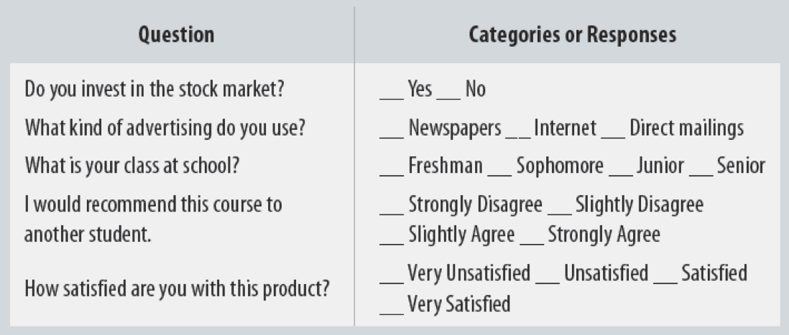

```{r setup, include=FALSE}
options(htmltools.dir.version = FALSE)
knitr::opts_chunk$set(echo=F,
                      message=F,
                      warning=F,
                      fig.retina=3)
library(tidyverse)
library(ggthemes)
library(parallel)

set.seed(256)
update_geom_defaults("label", list(family = "Fira Sans Condensed"))
update_geom_defaults("text", list(family = "Fira Sans Condensed"))
xaringanExtra::use_tile_view()
xaringanExtra::use_tachyons()
xaringanExtra::use_freezeframe()
xaringanExtra::use_extra_styles(hover_code_line = TRUE)
library(ggthemes)
library(wooldridge)
wages<-wooldridge::wage1
wages<-wages %>%
  mutate(Gender = factor(ifelse(female==0,
                         "Male",
                         "Female")))
```

class: inverse

# Outline

### [Working with `Factor` Variables in R](#3)

### [Regression with Dummy Variables](#12)

### [Recoding Dummies](#36)

### [Categorical Variables (More than 2 Categories)](#47)

---
# Categorical Data

.pull-left[

- .hi[Categorical data] place an individual into one of several possible *categories*
    - e.g. sex, season, political party
    - may be responses to survey questions
    - can be quantitative (e.g. age, zip code)

- `R` calls these `factors`
]

.pull-right[



]

---

class: inverse, center, middle

# Working with `factor` Variables in `R`

---

# Factors in R

.quitesmall[
- `factor` is a special type of `character` object class that indicates membership in a category (called a `level`)

- Suppose I have data on students:

```{r, echo = F}
students<-tibble(
  ID = seq(1,10,1),
  Rank = sample(c("Freshman", "Sophomore", "Junior", "Senior") , 10, replace = TRUE),
  Grade = round(rnorm(10,75,10),0)
)
```

```{r, echo = T}
students %>% head(n = 5)
```

]

--

.quitesmall[
- See that `Rank` is a `character` (`<chr>`) variable, just a string of text
]

---

# Factors in R

.quitesmall[
- We can make `Rank` a `factor` variable, to indicate a student is a member of one of the possible categories: (freshman, sophomore, junior, senior)

```{r, echo = T}
students <- students %>%
  mutate(Rank = as.factor(Rank)) # overwrite and change class of Rank to factor

students %>% head(n = 5)
```

.quitesmall[
- See now it’s a `factor` (`<fct>`)
]

]

---

# Factors in R

.smallest[

```{r, echo = T}
# what are the categories?
students %>%
  group_by(Rank) %>%
  count()

# note the order is arbitrary! This is an "unordered" factor
```

]

---

# Ordered Factors in R

.quitesmall[
- If there is a rank order you wish to preserve, you can make an `ordered` (`factor`) variable
  - list the `levels` from 1st to last

```{r, echo = T}
students <- students %>%
  mutate(Rank = ordered(Rank, # overwrite and change class of Rank to ordered
                        # next, specify the levels, in order
                        levels = c("Freshman", "Sophomore", "Junior", "Senior")
                        )
         )

students %>% head(n = 5)
```

]

---

# Ordered Factors in R

.quitesmall[

```{r, echo = T}
students %>%
  group_by(Rank) %>%
  count()
```
]

---

# Example Research Question

.pull-left[

.bg-washed-green.b--dark-green.ba.bw2.br3.shadow-5.ph4.mt5[
.green[**Example**]: How much higher wages, on average, do men earn compared to women?
]

]

.pull-right[
.center[

]
]

---

# The Pure Statistics of Comparing Group Means

.pull-left[

.smallest[
- Basic statistics: can test for statistically significant difference in group means with a **t-test**<sup>.magenta[†]</sup>, let:

- .blue[`\\(Y_M\\)`]: average earnings of a sample of .blue[`\\(n_M\\)`] men

- .magenta[`\\(Y_W\\)`]: average earnings of a sample of .magenta[`\\(n_W\\)`] women

- **Difference** in group averages: $d=$ .blue[`\\(\bar{Y}_M\\)`] $-$ .magenta[`\\(\bar{Y}_W\\)`]

- The hypothesis test is:
  - $H_0: d=0$
  - $H_1: d \neq 0$

]
]
.pull-right[
.center[

]
]

.footnote[<sup>.magenta[†]</sup> See [today’s class page](/content/3.6-content) for this example]

---

# Plotting Factors in R

.pull-left[

- If I plot a `factor` variable, e.g. `Gender` (which is either `Male` or `Female`), the scatterplot with `wage` looks like this
  - effectively `R` treats values of a factor variable as integers
  - in this case, `"Female"` = 0, `"Male"` = 1

- Let’s make this more explicit by making a .hi[dummy variable] to stand in for Gender
]

.pull-right[
```{r, fig.retina=3}
ggplot(data = wages)+
  aes(x = Gender,
      y = wage)+
  geom_point(aes(color = Gender))+
  geom_smooth(method = "lm", color = "black")+
  scale_y_continuous(labels=scales::dollar)+
  scale_color_manual(values = c("Female" = "#e64173", "Male" = "#0047AB"))+
  labs(x = "Female",
       y = "Wage")+
  guides(color=F)+ # hide legend
  theme_pander(base_family = "Fira Sans Condensed",
           base_size=20)
```
]

---

class: inverse, center, middle

# Regression with Dummy Variables

---

# Comparing Groups with Regression

.smallest[
- In a regression, we can easily compare across groups via a .hi[dummy variable]<sup>.magenta[†]</sup>

- Dummy variable *only* $=0$ or $=1$, if a condition is `TRUE` vs. `FALSE`

- Signifies whether an observation belongs to a category or not
]

.footnote[<sup>.magenta[†]</sup> Also called a .hi[binary variable] or .hi[dichotomous variable]]

--

.smallest[
.bg-washed-green.b--dark-green.ba.bw2.br3.shadow-5.ph4.mt5[
.green[**Example**]: 

$$\widehat{Wage_i}=\hat{\beta_0}+\hat{\beta_1}Female_i \quad \quad \text{ where } Female_i =
 		 \begin{cases}
    		1 & \text{if individual } i \text{ is } Female \\
   			0 & \text{if individual } i \text{ is } Male\\
  		\end{cases}$$

]
]
--

.smallest[
- Again, $\hat{\beta_1}$ makes less sense as the “slope” of a line in this context

]

---

# Comparing Groups in Regression: Scatterplot

.pull-left[

- `Female` is our dummy $x$-variable

- Hard to see relationships because of **overplotting**

]

.pull-right[
```{r, fig.retina=3}
ggplot(data = wages)+
  aes(x = female,
      y = wage)+
  geom_point(aes(color = Gender))+
  geom_smooth(method = "lm", color = "black")+
  scale_x_continuous(breaks=c(0,1),
                   labels=c(0,1))+
  scale_y_continuous(labels=scales::dollar)+
  scale_color_manual(values = c("Female" = "#e64173", "Male" = "#0047AB"))+
  labs(x = "Female",
       y = "Wage")+
  guides(color=F)+ # hide legend
  theme_pander(base_family = "Fira Sans Condensed",
           base_size=20)
```
]

---

# Comparing Groups in Regression: Scatterplot

.pull-left[

- `Female` is our dummy $x$-variable

- Hard to see relationships because of **overplotting**

- Tip: use `geom_jitter()` instead of `geom_point()` to *randomly* nudge points to see them better!
  - Only used for *plotting*, does not affect actual data, regression, etc.

]

.pull-right[
```{r, fig.retina=3}
ggplot(data = wages)+
  aes(x = female,
      y = wage)+
  geom_jitter(aes(color = Gender),
              width=0.05,
              seed = 2)+
  geom_smooth(method = "lm", color = "black")+
  scale_x_continuous(breaks=c(0,1),
                   labels=c(0,1))+
  scale_y_continuous(labels=scales::dollar)+
  labs(x = "Female",
       y = "Wage")+
  scale_color_manual(values = c("Female" = "#e64173", "Male" = "#0047AB"))+
  guides(color=F)+ # hide legend
  theme_pander(base_family = "Fira Sans Condensed",
           base_size=20)
```
]

---

# Comparing Groups in Regression: Scatterplot

.pull-left[

- `Female` is our dummy $x$-variable

- Hard to see relationships because of **overplotting**

- Use `geom_jitter()` instead of `geom_point()` to *randomly* nudge points
  - *Only* for plotting purposes, does not affect actual data, regression, etc.

]

.pull-right[
```{r, fig.retina=3}
male_avg<-wages %>%
  filter(female==0) %>%
  summarize(mean(wage)) %>%
  pull() # get just a number (not a dataframe)

female_avg<-wages %>%
  filter(female==1) %>%
  summarize(mean(wage)) %>%
  pull() # get just a number (not a dataframe)

ggplot(data = wages)+
  aes(x = female,
      y = wage)+
  geom_jitter(aes(color = Gender),
              width=0.05,
              seed = 2)+
  geom_smooth(method = "lm", color = "black")+
  geom_hline(yintercept=male_avg,linetype="dashed",color="#0047AB")+
  geom_label(x = 0.5, y=male_avg, label="Average for Men", color="#0047AB")+
  geom_hline(yintercept=female_avg,linetype="dashed",color="#e64173")+
  geom_label(x = 0.5, y=female_avg, label="Average for Women", color="#e64173")+
  scale_color_manual(values = c("Female" = "#e64173", "Male" = "#0047AB"))+
  scale_x_continuous(breaks=c(0,1),
                   labels=c(0,1))+
  scale_y_continuous(labels=scales::dollar)+
  labs(x = "Female",
       y = "Wage")+
  guides(color=F)+ # hide legend
  theme_pander(base_family = "Fira Sans Condensed",
           base_size=20)
```
]

---

# Dummy Variables as Group Means

.smallest[
$$\hat{Y_i}=\hat{\beta_0}+\hat{\beta_1} D_i \quad \text{ where }D_i=\{\color{#6A5ACD}{0},\color{#e64173}{1}\}$$
]
--

.smallest[
- .purple[When `\\(D_i=0\\)` (“Control group”):]
  - $\hat{Y_i}=\hat{\beta_0}$
  - $\color{#6A5ACD}{E[Y_i|D_i=0]}=\hat{\beta_0}$ $\iff$ the mean of $Y$ when $D_i=0$
]

--

.smallest[
- .hi[When `\\(D_i=1\\)` (“Treatment group”):]
  - $\hat{Y_i}=\hat{\beta_0}+\hat{\beta_1} D_i$
  - $\color{#e64173}{E[Y_i|D_i=1]}=\hat{\beta_0}+\hat{\beta_1}$ $\iff$ the mean of $Y$ when $D_i=1$
]

--

.smallest[

- So the **difference** in group means:

$$\begin{align*}
		&=\color{#e64173}{E[Y_i|D_i=1]}-\color{#6A5ACD}{E[Y_i|D_i=0]}\\
		&=(\hat{\beta_0}+\hat{\beta_1})-(\hat{\beta_0})\\
		&=\hat{\beta_1}\\
\end{align*}$$

]

---

# Dummy Variables as Group Means: Our Example

.pull-left[
.bg-washed-green.b--dark-green.ba.bw2.br3.shadow-5.ph4.mt5[
.green[**Example**]:

$$\widehat{Wage_i}=\hat{\beta_0}+\hat{\beta_1}Female_i$$

$$\text{where } Female_i =
 		 \begin{cases}
    		1 & \text{if } i \text{ is }Female \\
   			0 & \text{if } i \text{ is } Male\\
  		\end{cases}$$
]
]

.pull-right[

- Mean wage for men: 
]

---

# Dummy Variables as Group Means: Our Example

.pull-left[
.bg-washed-green.b--dark-green.ba.bw2.br3.shadow-5.ph4.mt5[
.green[**Example**]:

$$\widehat{Wage_i}=\hat{\beta_0}+\hat{\beta_1}Female_i$$

$$\text{where } Female_i =
 		 \begin{cases}
    		1 & \text{if } i \text{ is }Female \\
   			0 & \text{if } i \text{ is } Male\\
  		\end{cases}$$
]
]

.pull-right[

- Mean wage for men:
$$E[Wage|Female=0]=\hat{\beta_0}$$
]

---

# Dummy Variables as Group Means: Our Example

.pull-left[
.bg-washed-green.b--dark-green.ba.bw2.br3.shadow-5.ph4.mt5[
.green[**Example**]:

$$\widehat{Wage_i}=\hat{\beta_0}+\hat{\beta_1}Female_i$$

$$\text{where } Female_i =
 		 \begin{cases}
    		1 & \text{if } i \text{ is }Female \\
   			0 & \text{if } i \text{ is } Male\\
  		\end{cases}$$
]
]

.pull-right[

- Mean wage for men: 
$$E[Wage|Female=0]=\hat{\beta_0}$$

- Mean wage for women: 
]

---

# Dummy Variables as Group Means: Our Example

.pull-left[
.bg-washed-green.b--dark-green.ba.bw2.br3.shadow-5.ph4.mt5[
.green[**Example**]:

$$\widehat{Wage_i}=\hat{\beta_0}+\hat{\beta_1}Female_i$$

$$\text{where } Female_i =
 		 \begin{cases}
    		1 & \text{if } i \text{ is }Female \\
   			0 & \text{if } i \text{ is } Male\\
  		\end{cases}$$
]
]

.pull-right[

- Mean wage for men:
$$E[Wage|Female=0]=\hat{\beta_0}$$

- Mean wage for women:
$$E[Wage|Female=1]=\hat{\beta_0}+\hat{\beta_1}$$
]

---

# Dummy Variables as Group Means: Our Example

.pull-left[
.bg-washed-green.b--dark-green.ba.bw2.br3.shadow-5.ph4.mt5[
.green[**Example**]:

$$\widehat{Wage_i}=\hat{\beta_0}+\hat{\beta_1}Female_i$$

$$\text{where } Female_i =
 		 \begin{cases}
    		1 & \text{if } i \text{ is }Female \\
   			0 & \text{if } i \text{ is } Male\\
  		\end{cases}$$
]
]

.pull-right[

- Mean wage for men:
$$E[Wage|Female=0]=\hat{\beta_0}$$

- Mean wage for women:
$$E[Wage|Female=1]=\hat{\beta_0}+\hat{\beta_1}$$

- Difference in wage between men & women:
]

---

# Dummy Variables as Group Means: Our Example

.pull-left[
.bg-washed-green.b--dark-green.ba.bw2.br3.shadow-5.ph4.mt5[
.green[**Example**]:

$$\widehat{Wage_i}=\hat{\beta_0}+\hat{\beta_1}Female_i$$

$$\text{where } Female_i =
 		 \begin{cases}
    		1 & \text{if } i \text{ is }Female \\
   			0 & \text{if } i \text{ is } Male\\
  		\end{cases}$$
]
]

.pull-right[

- Mean wage for men: 
$$E[Wage|Female=0]=\hat{\beta_0}$$

- Mean wage for women: 
$$E[Wage|Female=1]=\hat{\beta_0}+\hat{\beta_1}$$

- Difference in wage between men & women: 
$$\hat{\beta_1}$$
]

---

# Comparing Groups in Regression: Scatterplot

.pull-left[
$$\widehat{Wage_i}=\hat{\beta_0}+\hat{\beta_1}Female_i$$

$$\text{where } Female_i =
 		 \begin{cases}
    		1 & \text{if } i \text{ is }Female \\
   			0 & \text{if } i \text{ is } Male\\
  		\end{cases}$$

]

.pull-right[
```{r, fig.retina=3}
ggplot(data = wages)+
  aes(x = female,
      y = wage)+
  geom_jitter(aes(color = Gender),
              width=0.05)+
  geom_smooth(method = "lm", color="black")+
  geom_hline(yintercept=male_avg,linetype="dashed",color="#0047AB")+
  geom_label(x = 0.5, y=male_avg, label=expression(hat(beta[0])), color="#0047AB")+
  geom_hline(yintercept=female_avg,linetype="dashed",color="#e64173")+
  geom_label(x = 0.5, y=female_avg, label=expression(hat(beta[0])+hat(beta[1])), color="#e64173")+
  geom_label(x = 0.75, y=5.5, label=expression(paste(hat(beta[1]),"= difference")), color="black")+
  scale_color_manual(values = c("Female" = "#e64173", "Male" = "#0047AB"))+
  scale_x_continuous(breaks=c(0,1),
                   labels=c(0,1))+
  scale_y_continuous(labels=scales::dollar)+
  labs(x = "Female",
       y = "Wage")+
  guides(color=F)+ # hide legend
  theme_pander(base_family = "Fira Sans Condensed",
           base_size=20)
```
]

---

# The Data

.quitesmall[
```{r, echo=T, eval = F}
# comes from wooldridge package

# install.packages("wooldridge")
library(wooldridge)

# data is called "wage1", save as a dataframe I'll call "wages"
wages <- wage1

wages %>% head()
```
]

---

# Get Group Averages & Std. Devs. 

.pull-left[

.smallest[
```{r, echo=T}
# Summarize for Men

wages %>%
  filter(female==0) %>%
  summarize(mean = mean(wage),
            sd = sd(wage))
```

]

]

.pull-right[

.smallest[
```{r, echo=T}
# Summarize for Women

wages %>%
  filter(female==1) %>%
  summarize(mean = mean(wage),
            sd = sd(wage))
```

]
]

---

# Visualize Differences

```{r, fig.width=14}
ggplot(data = wages)+
  aes(x = wage,
      fill = Gender)+
  geom_density(alpha=0.5, color = "white")+
  scale_x_continuous(labels=scales::dollar)+
  labs(x = "wage",
       y = "Density",
       title = "Conditional Wage Distribution by Gender")+
  scale_fill_manual("Gender", labels=c("Women","Men"), values = c("Female" = "#e64173", "Male" = "#0047AB"))+
    theme_pander(base_family = "Fira Sans Condensed",
           base_size=20)
```

---

# The Regression I

.pull-left[
.tiny[
.code90[
```{r, echo=T}
femalereg <- lm(wage ~ female, data = wages)
summary(femalereg)
```
]
]
]

--

.pull-right[
.tiny[
```{r, echo=T}
library(broom)

tidy(femalereg)
```
]
]

---

# Dummy Regression vs. Group Means

.pull-left[

.smallest[
From tabulation of group means

| Gender | Avg. Wage | Std. Dev.   | $n$   |
|--------|-------------|-----------|-------|
| Female | $4.59$    | $2.33$      | $252$ |
| Male   | $7.10$    | $4.16$      | $274$ |
| Difference | $2.51$ | $0.30$ | $-$ |

From $t$-test of difference in group means
]

]

.pull-right[
.quitesmall[
```{r}
tidy(femalereg)
```
]

$$\widehat{\text{Wages}_i}=7.10-2.51 \, \text{Female}_i$$
]

---

class: inverse, center, middle

# Recoding Dummies

---

# Recoding Dummies

.bg-washed-green.b--dark-green.ba.bw2.br3.shadow-5.ph4.mt5[
.green[**Example**]: 

- Suppose instead of $female$ we had used:

$$\widehat{Wage_i}=\hat{\beta_0}+\hat{\beta_1}Male_i \quad \quad \text{ where } Male_i =
 		 \begin{cases}
    		1 & \text{if person } i \text{ is } Male \\
   			0 & \text{if person } i \text{ is } Female\\
  		\end{cases}$$

]

---

# Recoding Dummies with Data

.quitesmall[
```{r,echo = T}
wages<-wages %>%
  mutate(male = ifelse(female == 0, # condition: is female equal to 0?
                       yes = 1, # if true: code as "1"
                       no = 0)) # if false: code as "0"

# verify it worked
wages %>% 
  select(wage, female, male) %>%
  head()
```
]

---

# Scatterplot with Male

.pull-left[
```{r}
ggplot(data = wages)+
  aes(x = female,
      y = wage)+
  geom_jitter(aes(color = Gender),
              width=0.05)+
  geom_smooth(method = "lm", color = "black")+
  geom_hline(yintercept=male_avg,linetype="dashed",color="#0047AB")+
  geom_label(x = 0.5, y=male_avg, label="Average for Men", color="#0047AB")+
  geom_hline(yintercept=female_avg,linetype="dashed",color="#e64173")+
  geom_label(x = 0.5, y=female_avg, label="Average for Women", color="#e64173")+
  scale_color_manual(values = c("Female" = "#e64173", "Male" = "#0047AB"))+
  scale_x_continuous(breaks=c(0,1),
                   labels=c(0,1))+
  scale_y_continuous(labels=scales::dollar)+
  labs(x = "Female",
       y = "Wage")+
  guides(color=F)+ # hide legend
  theme_pander(base_family = "Fira Sans Condensed",
           base_size=20)

```
]

--

.pull-right[
```{r}
wages<-wages %>%
  mutate(male = ifelse(female==0,
                         1,
                         0))

ggplot(data = wages)+
  aes(x = male,
      y = wage)+
  geom_jitter(aes(color = Gender),
              width=0.05)+
  geom_smooth(method = "lm", color = "black")+
  geom_hline(yintercept=male_avg,linetype="dashed",color="#0047AB")+
  geom_label(x = 0.5, y=male_avg, label="Average for Men", color="#0047AB")+
  geom_hline(yintercept=female_avg,linetype="dashed",color="#e64173")+
  geom_label(x = 0.5, y=female_avg, label="Average for Women", color="#e64173")+
  scale_color_manual(values = c("Female" = "#e64173", "Male" = "#0047AB"))+
  scale_x_continuous(breaks=c(0,1),
                   labels=c(0,1))+
  scale_y_continuous(labels=scales::dollar)+
  labs(x = "Male",
       y = "Wage")+
  guides(color=F)+ # hide legend
  theme_pander(base_family = "Fira Sans Condensed",
           base_size=20)
```
]

---

# Dummy Variables as Group Means: With Male

.pull-left[
.bg-washed-green.b--dark-green.ba.bw2.br3.shadow-5.ph4.mt5[
.green[**Example**]:

$$\widehat{Wage_i}=\hat{\beta_0}+\hat{\beta_1}Male_i$$

$$\text{where } Male_i =
 		 \begin{cases}
    		1 & \text{if } i \text{ is } Male \\
   			0 & \text{if } i \text{ is } Female\\
  		\end{cases}$$
]
]

.pull-right[

- Mean wage for men: 
$$E[Wage|Male=1]=\hat{\beta_0}+\hat{\beta_1}$$

- Mean wage for women: 
$$E[Wage|Male=0]=\hat{\beta_0}$$

- Difference in wage between men & women: 
$$\hat{\beta_1}$$
]

---

# Scatterplot with Male 

.pull-left[
```{r}
ggplot(data = wages)+
  aes(x = female,
      y = wage)+
  geom_jitter(aes(color = Gender),
              width=0.05)+
  geom_smooth(method = "lm", color="black")+
  geom_hline(yintercept=male_avg,linetype="dashed",color="#0047AB")+
  geom_label(x = 0.5, y=male_avg, label=expression(hat(beta[0])), color="#0047AB")+
  geom_hline(yintercept=female_avg,linetype="dashed",color="#e64173")+
  geom_label(x = 0.5, y=female_avg, label=expression(hat(beta[0])+hat(beta[1])), color="#e64173")+
  geom_label(x = 0.75, y=5.5, label=expression(paste(hat(beta[1]),"= difference")), color="black")+
  scale_color_manual(values = c("Female" = "#e64173", "Male" = "#0047AB"))+
  scale_x_continuous(breaks=c(0,1),
                   labels=c(0,1))+
  scale_y_continuous(labels=scales::dollar)+
  labs(x = "Female",
       y = "Wage")+
  guides(color=F)+ # hide legend
  theme_pander(base_family = "Fira Sans Condensed",
           base_size=20)
```
]

--
.pull-right[
```{r}
ggplot(data = wages)+
  aes(x = male,
      y = wage)+
  geom_jitter(aes(color = Gender),
              width=0.05)+
  geom_smooth(method = "lm", color="black")+
  geom_hline(yintercept=male_avg,linetype="dashed",color="#0047AB")+
  geom_label(x = 0.5, y=male_avg, label=expression(hat(beta[0])+hat(beta[1])), color="#0047AB")+
  geom_hline(yintercept=female_avg,linetype="dashed",color="#e64173")+
  geom_label(x = 0.5, y=female_avg, label=expression(hat(beta[0])), color="#e64173")+
  geom_label(x = 0.75, y=5.5, label=expression(paste(hat(beta[1]),"= difference")), color="black")+
  scale_color_manual(values = c("Female" = "#e64173", "Male" = "#0047AB"))+
  scale_x_continuous(breaks=c(0,1),
                   labels=c(0,1))+
  scale_y_continuous(labels=scales::dollar)+
  labs(x = "Male",
       y = "Wage")+
  guides(color=F)+ # hide legend
  theme_pander(base_family = "Fira Sans Condensed",
           base_size=20)
```
]

---

# The Regression with Male I

.pull-left[
.tiny[
.code90[
```{r, echo=T}
malereg <- lm(wage ~ male, data = wages)

summary(malereg)
```
]
]
]

--

.pull-right[
.tiny[
```{r, echo=T}
library(broom)
tidy(malereg)
```
]
]

---

# The Dummy Regression: Male or Female

.pull-left[
.quitesmall[
```{r}
library(huxtable)
huxreg(malereg, femalereg,
       coefs = c("Constant" = "(Intercept)",
                 "Female" = "female",
                 "Male" = "male"),
       statistics = c("N" = "nobs",
                      "R-Squared" = "r.squared",
                      "SER" = "sigma"),
       number_format = 2)
```

]
]

.pull-right[

- Note it doesn't matter if we use `male` or `female`, males always earn $2.51 more than females

- Compare the constant (average for the $D=0$ group)

- Should you use `male` AND `female`? We'll come to that...

]

---

class: inverse, center, middle

# Categorical Variables (More than 2 Categories)

---

# Categorical Variables with More than 2 Categories

- A .hi[categorical variable] expresses membership in a category, where there is no ranking or hierarchy of the categories
    - We've looked at categorical variables with 2 categories only
    - e.g. Male/Female, Spring/Summer/Fall/Winter, Democratic/Republican/Independent

--

- Might be an .hi[ordinal variable] expresses rank or an ordering of data, but not necessarily their relative magnitude
    - e.g. Order of finalists in a competition (1st, 2nd, 3rd)
    - e.g. Highest education attained (1=elementary school, 2=high school, 3=bachelor's degree, 4=graduate degree)

---

# Using Categorical Variables in Regression I

.bg-washed-green.b--dark-green.ba.bw2.br3.shadow-5.ph4.mt5[
.green[**Example**]: How do wages vary by region of the country? Let $Region_i=\{Northeast, \, Midwest, \, South, \, West\}$
]

--

- Can we run the following regression?

$$\widehat{Wages_i}=\hat{\beta_0}+\hat{\beta_1}Region_i$$

---

# Using Categorical Variables in Regression II

.bg-washed-green.b--dark-green.ba.bw2.br3.shadow-5.ph4.mt5[
.green[**Example**]: How do wages vary by region of the country? 

]

Code region numerically: 
$$Region_i=
\begin{cases}1 & \text{if } i \text{ is in }Northeast\\
   			2 & \text{if } i \text{ is in } Midwest\\
    		3 & \text{if } i \text{ is in } South \\
   			4 & \text{if } i \text{ is in } West\\ 
\end{cases}$$

--

- Can we run the following regression?

$$\widehat{Wages_i}=\hat{\beta_0}+\hat{\beta_1}Region_i$$

---

# Using Categorical Variables in Regression III

.smallest[
.bg-washed-green.b--dark-green.ba.bw2.br3.shadow-5.ph4.mt5[
.green[**Example**]: How do wages vary by region of the country? 

Create a dummy variable for *each* region: 

- $Northeast_i = 1$ if $i$ is in Northeast, otherwise $=0$
- $Midwest_i = 1$ if $i$ is in Midwest, otherwise $=0$
- $South_i = 1$ if $i$ is in South, otherwise $=0$
- $West_i = 1$ if $i$ is in West, otherwise $=0$

]
]

--

.smallest[
- Can we run the following regression?

$$\widehat{Wages_i}=\hat{\beta_0}+\hat{\beta_1}Northeast_i+\hat{\beta_2}Midwest_i+\hat{\beta_3}South_i+\hat{\beta_4}West_i$$
]

--

.smallest[
- For every $i: \, Northeast_i+Midwest_i+South_i+West_i=1$!
]

---

# The Dummy Variable Trap

.bg-washed-green.b--dark-green.ba.bw2.br3.shadow-5.ph4.mt5[
.green[**Example**]: $\widehat{Wages_i}=\hat{\beta_0}+\hat{\beta_1}Northeast_i+\hat{\beta_2}Midwest_i+\hat{\beta_3}South_i+\hat{\beta_4}West_i$

]

- If we include *all* possible categories, they are .hi-purple[perfectly multicollinear], an exact linear function of one another: 

$$Northeast_i+Midwest_i+South_i+West_i=1 \quad \forall i$$

- This is known as the .hi[dummy variable trap], a common source of perfect multicollinearity 

---

# The Reference Category


- To avoid the dummy variable trap, always omit one category from the regression, known as the .hi[“reference category”]

- It does not matter which category we omit!

- .hi-purple[Coefficients on each dummy variable measure the *difference* between the *reference* category and each category dummy]

---

# The Reference Category: Example

.bg-washed-green.b--dark-green.ba.bw2.br3.shadow-5.ph4.mt5[
.green[**Example**]: $\widehat{Wages_i}=\hat{\beta_0}+\hat{\beta_1}Northeast_i+\hat{\beta_2}Midwest_i+\hat{\beta_3}South_i$
]


- $West_i$ is omitted (arbitrarily chosen)

--

- $\hat{\beta_0}$: 

---

# The Reference Category: Example

.bg-washed-green.b--dark-green.ba.bw2.br3.shadow-5.ph4.mt5[
.green[**Example**]: $\widehat{Wages_i}=\hat{\beta_0}+\hat{\beta_1}Northeast_i+\hat{\beta_2}Midwest_i+\hat{\beta_3}South_i$
]


- $West_i$ is omitted (arbitrarily chosen)

- $\hat{\beta_0}$: average wage for $i$ in the West

--

- $\hat{\beta_1}$:

---

# The Reference Category: Example

.bg-washed-green.b--dark-green.ba.bw2.br3.shadow-5.ph4.mt5[
.green[**Example**]: $\widehat{Wages_i}=\hat{\beta_0}+\hat{\beta_1}Northeast_i+\hat{\beta_2}Midwest_i+\hat{\beta_3}South_i$
]


- $West_i$ is omitted (arbitrarily chosen)

- $\hat{\beta_0}$: average wage for $i$ in the West

- $\hat{\beta_1}$: difference between West and Northeast

--

- $\hat{\beta_2}$:

---

# The Reference Category: Example

.bg-washed-green.b--dark-green.ba.bw2.br3.shadow-5.ph4.mt5[
.green[**Example**]: $\widehat{Wages_i}=\hat{\beta_0}+\hat{\beta_1}Northeast_i+\hat{\beta_2}Midwest_i+\hat{\beta_3}South_i$
]


- $West_i$ is omitted (arbitrarily chosen)

- $\hat{\beta_0}$: average wage for $i$ in the West

- $\hat{\beta_1}$: difference between West and Northeast

- $\hat{\beta_2}$: difference between West and Midwest

--

- $\hat{\beta_3}$: 

---

# The Reference Category: Example

.bg-washed-green.b--dark-green.ba.bw2.br3.shadow-5.ph4.mt5[
.green[**Example**]: $\widehat{Wages_i}=\hat{\beta_0}+\hat{\beta_1}Northeast_i+\hat{\beta_2}Midwest_i+\hat{\beta_3}South_i$
]


- $West_i$ is omitted (arbitrarily chosen)

- $\hat{\beta_0}$: average wage for $i$ in the West

- $\hat{\beta_1}$: difference between West and Northeast

- $\hat{\beta_2}$: difference between West and Midwest

- $\hat{\beta_3}$: difference between West and South

---

# Dummy Variable Trap in R

.smallest[
.code50[
```{r}
# create northeast dummy as the final category
wages$noreast<-ifelse((wages$northcen==0 & wages$south==0 & wages$west==0),1,0)
```

```{r, echo=T}
lm(wage ~ noreast + northcen + south + west, data = wages) %>% summary()
```
]
]

---

# Using Different Reference Categories in R

.code50[
```{r}
# create northeast dummy as the final category
wages$noreast<-ifelse((wages$northcen==0 & wages$south==0 & wages$west==0),1,0)
```

```{r dummyregs, echo=T, eval=F}
# let's run 4 regressions, each one we omit a different region
no_noreast_reg <- lm(wage ~ northcen + south + west, data = wages)
no_northcen_reg <- lm(wage ~ noreast + south + west, data = wages)
no_south_reg <- lm(wage ~ noreast + northcen + west, data = wages)
no_west_reg <- lm(wage ~ noreast + northcen + south, data = wages)

# now make an output table
library(huxtable)
huxreg(no_noreast_reg,
       no_northcen_reg,
       no_south_reg,
       no_west_reg,
       coefs = c("Constant" = "(Intercept)",
                 "Northeast" = "noreast",
                 "Midwest" = "northcen",
                 "South" = "south",
                 "West" = "west"),
       statistics = c("N" = "nobs",
                      "R-Squared" = "r.squared",
                      "SER" = "sigma"),
       number_format = 3)
```
]

---

# Using Different Reference Categories in R II

.pull-left[
.tiny[
```{r, ref.label="dummyregs"}

```
]
]

.pull-right[

.smallest[
- Constant is alsways average wage for reference (omitted) region

- Compare coefficients between Midwest in (1) and Northeast in (2)...

- Compare coefficients between West in (3) and South in (4)...

- Does not matter which region we omit!
  - Same $R^2$, SER, coefficients give same results
]

]

---

# Dummy *Dependent* (Y) Variables

.smallest[
- In many contexts, we will want to have our *dependent* $(Y)$ variable be a dummy variable
]
--

.smallest[
.bg-washed-green.b--dark-green.ba.bw2.br3.shadow-5.ph4.mt5[
.green[**Example**]: 
$$\widehat{Admitted_i}=\hat{\beta_0}+\hat{\beta_1}GPA_i \quad \text{ where } Admitted_i =
 		 \begin{cases}
    		1 & \text{if } i \text{ is Admitted} \\
   			0 & \text{if } i \text{ is  Not Admitted}\\
  		\end{cases}$$
]
]
--

.smallest[
- A model where $Y$ is a dummy is called a .hi[linear probability model], as it measures the .hi-purple[probability of `\\(Y\\)` occuring `\\((=1)\\)` given the X's, i.e. `\\(P(Y_i=1|X_1, \cdots, X_k)\\)`]
    - e.g. the probability person $i$ is Admitted to a program with a given GPA
]
--

.smallest[
- Requires special tools to properly interpret and extend this (**logit**, **probit**, etc)

- Feel free to write papers that have dummy $Y$ variables (but you may have to ask me some more questions)!
]